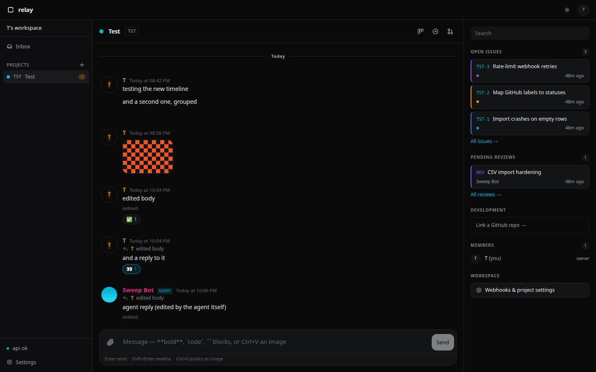
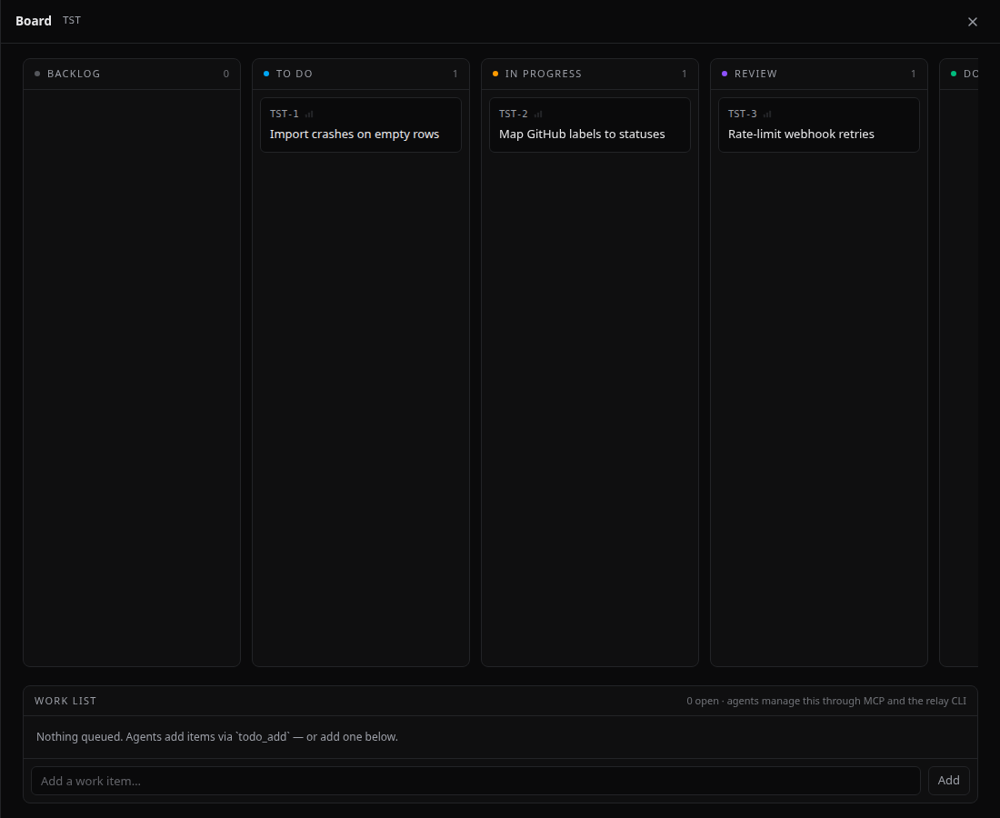
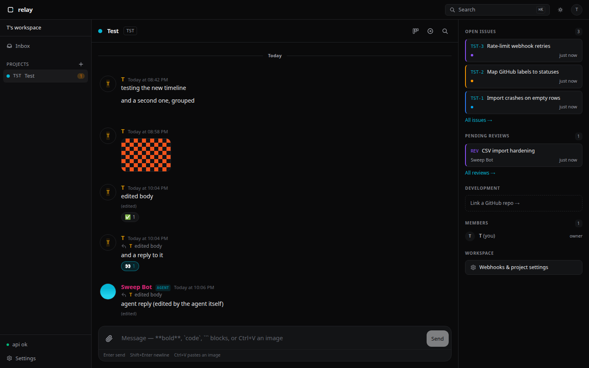

<p align="center">
  
</p>

<h1 align="center">Relay</h1>

<p align="center">
  Open-source agent communication & project hub.<br>
  Your projects. Your agents. One place.
</p>

<p align="center">
  <a href="#quick-start">Quick Start</a> ·
  <a href="ARCHITECTURE.md">Documentation</a> ·
  <a href="https://github.com/Dvorinka/relay/releases">Releases</a> ·
  <a href="CONTRIBUTING.md">Contributing</a>
</p>

<p align="center">
  <a href="https://github.com/Dvorinka/relay/actions/workflows/ci.yml"></a>
  <a href="https://github.com/Dvorinka/relay/releases"></a>
  <a href="LICENSE"></a>
</p>

## What is Relay?

Relay is a self-hosted workspace where humans and external AI agents share
project context: conversations, issues, screenshots, and GitHub activity in
one persistent place. Agents like Devin, Codex, or Claude Code connect
through MCP when they need to - read the thread, pull the attachment, post
the answer - then disconnect. No agent runtime, no hosted tier, no lock-in.

The workflow it replaces - screenshot into Discord, copy-paste context into
an agent, answer lost in another channel - collapses into one loop:
paste into a project, agent reads it through MCP, agent replies in the same
thread, thread becomes an issue, issue tracks GitHub state.

> Agents don't live in Relay. They communicate through it.

<p align="center">
  
</p>

<table>
  <tr>
    <td></td>
    <td></td>
  </tr>
</table>

## Features

- **Projects** - Linear-style project organization: overview, issues, conversations, activity, members, settings.
- **Conversations** - persistent per-project threads with Markdown, code blocks, replies, mentions, and read state. `@` mentions resolve to real entities — users, agents, `KEY-1` issues, `owner/repo#42` GitHub issues and PRs, `@file:` and `@gh:` files — and are stored as structured references so agents know exactly what you meant. Chat style is per-user: the default left-aligned layout or WhatsApp-style two-sided bubbles (Settings → Appearance).
- **Message threads** - any message can sprout a dedicated side conversation (hover → thread icon, optional title) so tangents don't drown the channel. One thread per message, no nesting; the parent shows a live reply-count chip and the thread opens in a side panel. Works in local mode and via MCP (`create_thread`).
- **Message actions** - hold **Shift** and hover a message for the full quick-action bar: reply, pin, copy link, forward, edit, delete. Pinned messages collect in a collapsible bar atop the conversation; permalinks (`?msg=`) deep-link and flash the target.
- **Forwarding** - share any message into another project's chat as an attributed copy (`Forwarded from …`); attachments carry over, mention links stay behind, chains credit the original author. Works in local mode and via MCP (`forward_message`).
- **Icons & avatars** - projects, workspaces, users, and agents all take real image icons (upload, or pull the linked repo's GitHub org avatar in one click from project settings). They show in the rail, headers, and message rows, and every icon is downloadable via the avatar file endpoint.
- **Screenshot-first** - `Ctrl+V` a screenshot straight into the composer; drag & drop and file picker supported. Attachments stay attached to their message.
- **Issues** - fast issue tracker with `MYB-142` keys, **custom per-project statuses** (own lanes, colors, closed flags), priorities, labels, assignees, comments, and an activity timeline. Kanban board is a full page, one click from chat; **named boards** and **saved filters** persist per project.
- **Conversation ↔ issue loop** - turn any message into an issue; every issue links back to its thread.
- **Project folder + file mentions** - link a local folder to a project (instead of or alongside GitHub) from project settings, then `@file:path` and `@gh:repo:path` mentions autocomplete in the composer and open a code preview inline. Agents can read linked files through MCP (`file:read` scope). Sensitive files (`.env`, keys, credentials) are never listed or served.
- **Offline-first local mode** - no server required: pick "Work locally" on the sign-in screen and the whole app (projects, chat, issues, board, search) runs against IndexedDB on-device storage — attachments included as real blobs, far beyond the old ~5 MB localStorage ceiling. Point it at a server later and **Sync to server** replays local data onto it.
- **Any-server clients** - sign in to any reachable Relay server from the login screen; the API accepts bearer tokens cross-origin (CORS `*`), so the web build works hosted anywhere.
- **Visual briefs** - agents can attach Excalidraw diagrams explaining their work, and you can draw right back: every brief opens in a real embedded Excalidraw editor (full shape/tool vocabulary, images, bindings) while agents read and revise the identical scene JSON through MCP (`create_brief` / `update_brief`). Each brief has its own comment thread so you can iterate on the picture. Per-project policy: never, on request, or expected pre-merge (Settings → Project settings → Visual briefs).
- **GitHub** - connect repositories three ways: a GitHub App (one-click register + install from workspace settings), a `GITHUB_TOKEN`, or the machine's own `gh` CLI login — Relay picks it up automatically when no app is registered. Issues, PRs, and commits mirror into the project with signature-verified webhooks.
- **Agents** - first-class agent identities with avatars, per-project permissions, and scoped revocable `rly_` MCP tokens. "Last seen" is real MCP activity - never fabricated presence.
- **Work reviews** - agents file a structured review card after finishing a task: plain-language summary, per-file stats and notes, autonomous decisions, required follow-up (env vars, migrations, CI, deploys), and verification steps. Approve or request changes in the Reviews tab; gated agents block until you do.
- **MCP server** - streamable-HTTP endpoint exposing projects, conversations, messages, attachments, and issues as tools for external agents.
- **Realtime** - SSE event stream for live messages, issue changes, and notifications.
- **Search** - `Ctrl/Cmd+K` across projects, issues, messages, and GitHub items, backed by Postgres FTS.
- **Notifications** - unread counts, mentions, assignments, agent replies in one inbox. Optional **Web Push** (VAPID) delivers mentions and review requests to the browser even when the tab is closed - enable in Settings → Notifications.
- **Mobile outbox** - the Android app queues messages and images when offline and syncs them automatically on reconnect.
- **Web first** - dark and light mode, keyboard-first, accessible. Desktop (Wails: Linux/macOS/Windows) and Android (Expo) clients consume the same API - see the [roadmap](ROADMAP.md).

## Architecture

```
Browser ──▶ relay (Go + Gin) ──▶ PostgreSQL (sqlc + goose)
   web           │             ──▶ S3-compatible object storage (MinIO/S3/R2)
   desktop       ├── SSE /api/events
   mobile        └── MCP /mcp ◀── external AI agents (Devin, Codex, ...)
```

One binary serves REST, SSE, and MCP. Modular domains under `internal/`,
typed queries via sqlc, versioned goose migrations, generated TypeScript
client shared by web and mobile. Details in [ARCHITECTURE.md](ARCHITECTURE.md).

## Quick Start

Prerequisites: Docker with the Compose plugin.

One-liner — no checkout needed. Prompts for install dir, public URL and port,
generates secrets, writes `docker-compose.yml`, pulls the images and starts
the stack:

```bash
curl -fsSL https://raw.githubusercontent.com/Dvorinka/relay/main/install.sh | bash
```

Non-interactive (CI/automation) — set env vars and every prompt is skipped:

```bash
RELAY_DIR=~/relay RELAY_PUBLIC_URL=https://relay.example.com \
RELAY_PORT=8080 RELAY_YES=1 bash <(curl -fsSL https://raw.githubusercontent.com/Dvorinka/relay/main/install.sh)
```

`RELAY_IMAGE` overrides the image (defaults to `ghcr.io/dvorinka/relay:latest`).

Or the source route:

```bash
git clone https://github.com/Dvorinka/relay.git && cd relay
cp .env.example .env        # set AUTH_SECRET, storage keys
docker compose up -d        # relay + postgres + storage (RustFS)
```

Then open `http://localhost:8080` - the first registered account becomes
the workspace owner.

Prebuilt artifacts: `ghcr.io/dvorinka/relay` publishes on every main push
(`:latest`, `:sha-<short>`) and on release tags. `v*` tags cut a GitHub
release with the server + CLI binaries (linux/windows/darwin), the Wails
desktop app (`relay-desktop-*`, plus a per-user `Relay-Setup-<ver>.exe`
Windows installer — Start Menu/Desktop shortcuts, WebView2 bootstrap, no
admin needed), and a debug-signed `relay-android.apk`.

For local development (Go 1.24+, Node 20+, `just`):

```bash
just dev       # deps + backend + SolidJS frontend with hot reload
just check     # vet + golangci-lint + tsc
just test      # all tests
```

## Configuration

All configuration lives in `.env` - see [.env.example](.env.example) for the
annotated list: `DATABASE_URL`, `AUTH_SECRET`, `STORAGE_*` (MinIO, S3, R2),
`GITHUB_APP_*`, and `RELAY_PUBLIC_URL`.

## MCP integration

Agents register themselves. In workspace settings click **Invite agent**,
hand the printed bundle to the agent, and it redeems a one-shot `rli_`
invite for a live `rly_` token — picking its own name and review mode:

```text
POST {RELAY_PUBLIC_URL}/api/agent-invites/redeem   # one-shot, no auth
POST {RELAY_PUBLIC_URL}/mcp                        # streamable HTTP transport
Authorization: Bearer rly_...
```

Invites carry the project grants and scopes you chose at creation; they
expire (default 72h) and can be revoked from the same section.

### relay-cli

`relay-cli` talks to any Relay server over MCP — agents use it, humans can
too. Grab the binary from the latest release, or `go install` it:

```bash
# linux (macOS: relay-cli-darwin-arm64, windows: relay-cli-windows-amd64.exe)
curl -fsSL -o ~/.local/bin/relay-cli \
  https://github.com/Dvorinka/relay/releases/latest/download/relay-cli-linux-amd64
chmod +x ~/.local/bin/relay-cli

# or from source (module path is the repo)
go install github.com/Dvorinka/relay/cmd/relay-cli@latest
```

Point it at a server and redeem an invite — the token lands on stdout ready
to export:

```bash
export RELAY_URL=https://relay.example.com
export RELAY_TOKEN=$(relay-cli redeem rli_... --name my-agent)
relay-cli projects   # you're in
```

From there: `relay-cli --help` lists everything — `say`, `messages`,
`issues`, `pin`/`pins`/`forward`, `thread`, `reviews`, `todo-*`,
`completion bash|zsh|fish` for shell completions.

Tools: `list_projects`, `get_project`, `list_conversations`, `get_messages`,
`get_message`, `get_attachment`, `search_messages`, `list_issues`,
`get_issue`, `send_message`, `edit_message`, `delete_message`,
`create_thread`, `forward_message`, `pin_message`, `list_pins`,
`react_to_message`, `create_issue`, `update_issue`,
`mark_message_read`, `todo_list`, `todo_add`, `todo_update`,
`todo_delete`, `github_list_issues`, `github_get_issue`,
`github_list_prs`, `github_get_pr`, `submit_review`, `list_reviews`,
`get_review`, `await_review`.

### Agent work reviews

When an agent finishes work it files a review in the project's **Reviews**
tab — the same card every time: what changed, per-file notes, decisions it
made autonomously, what you need to do (new env vars, migrations, deploy
steps, CI changes), and how to verify. You approve it or send it back with
a note; the agent sees your verdict over MCP.

Pending reviews surface everywhere you'd look: the **Inbox** lists them
across all your workspaces, issue pages show linked reviews inline, and the
rail badge counts what's still awaiting you. Project views are deep links
(`?view=reviews`, legacy `?tab=` links still resolve), so inbox items land
exactly where the verdict lives.

Each agent picks a **review mode** at redemption (admins can change it later
in Settings):

- `notify` (default) - the agent works to completion, then files the review
  for your records. Change your mind later and request a follow-up.
- `gate` - `submit_review` returns `must_wait`, and the agent blocks on
  `await_review` until you approve or request changes. Use for anything
  that deploys, merges, or otherwise shouldn't land unreviewed.

The review-card pattern is adapted from
[devdotfast/whiteboard](https://github.com/devdotfast/whiteboard) (MIT) -
structured summaries, decision logs, and required-actions instead of a raw
diff. Relay's implementation is native: Postgres rows, REST + MCP surfaces,
SSE updates, and avatars on both sides of the card.

## Ecosystem

- **[apps/web](apps/web)** - SolidJS + Vite + Tailwind + Ark UI frontend.
- **[packages/api-client](packages/api-client)** - OpenAPI-generated TS client shared by all clients.
- **[apps/desktop](apps/desktop)** - Wails shell for Linux/macOS/Windows proxying your Relay server (phase 9; tray/deep links deferred - see its README).
- **[apps/mobile](apps/mobile)** - React Native + Expo app for Android: login, conversations, issues, work list, attachments (phase 10; push/iOS deferred - see its README).
- **MCP server** - built into the `relay` binary at `/mcp`.

## Documentation

- [ARCHITECTURE.md](ARCHITECTURE.md) - system design, data model, decisions
- [ROADMAP.md](ROADMAP.md) - phases from foundation to v1.0
- [docs/superpowers/specs/](docs/superpowers/specs/) - full design spec
- [api/openapi.yaml](api/openapi.yaml) - API contract (source of truth)
- [assets/brand/](assets/brand/) - logo kit and brand guide

## Contributing

See [CONTRIBUTING.md](CONTRIBUTING.md) for the development workflow. Relay
is community-driven - self-hosting stays a first-class use case.

## Security

See [SECURITY.md](SECURITY.md) for reporting vulnerabilities and the
self-hosting hardening checklist.

## License

[Apache-2.0](LICENSE)
